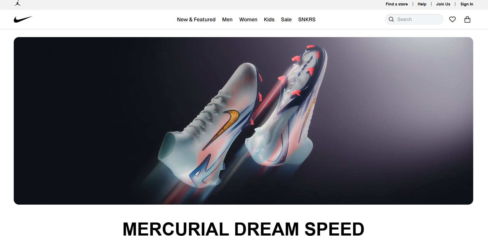
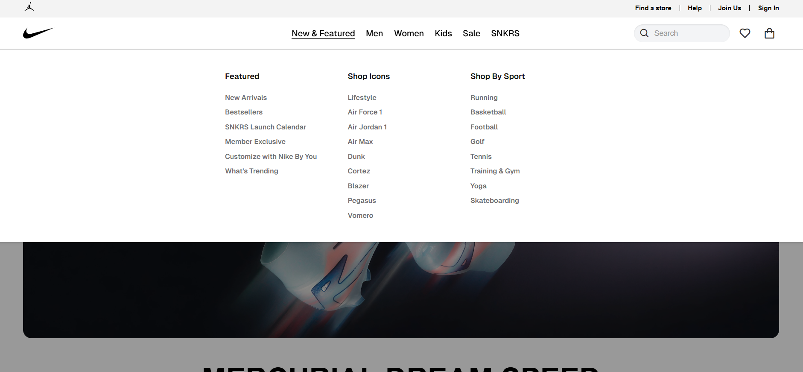
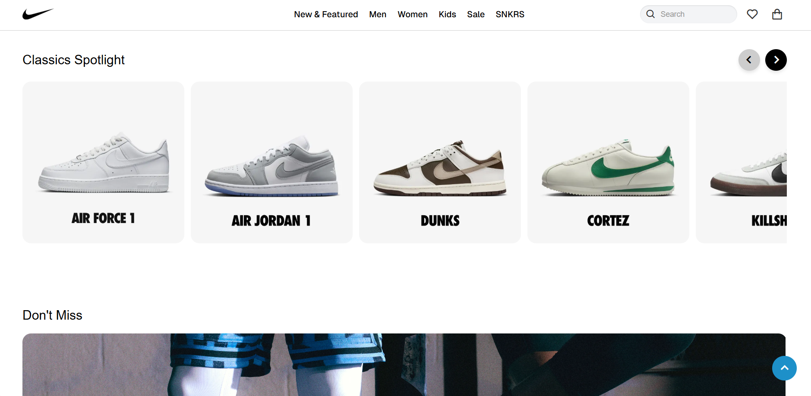
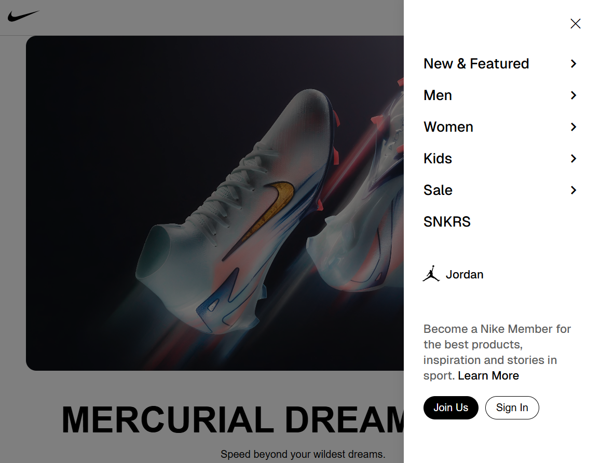
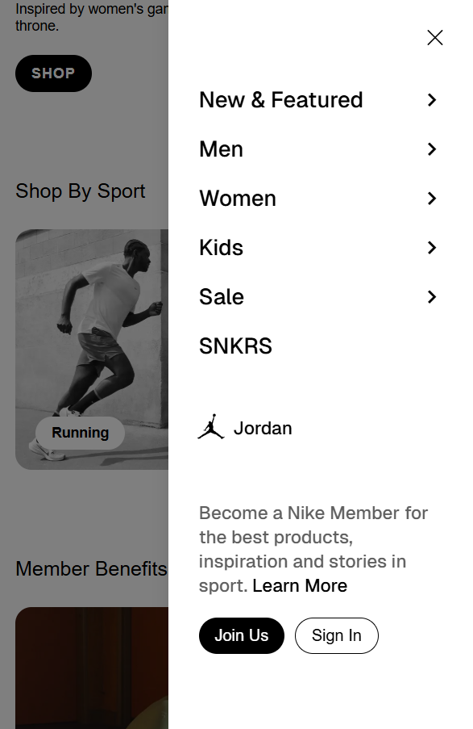

# Nike Website Clone

A responsive clone of the Nike official website built with HTML, CSS, and JavaScript.


## Installation

1. Clone the repository
   ```bash
    git clone https://github.com/CodemaxAI/Nike-app-clone.git
    cd Nike-app-clone
   ```

2. Open `index.html` in your browser to view the website.


## Screenshots

### Homepage


### Homepage Dropdown


### Mainpage


### Side Menu


### Responsive Design

